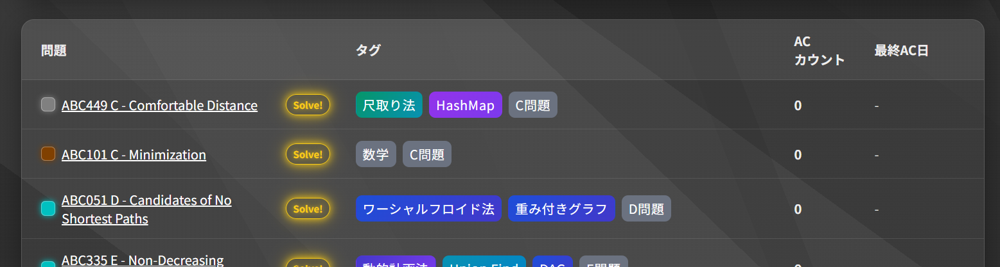
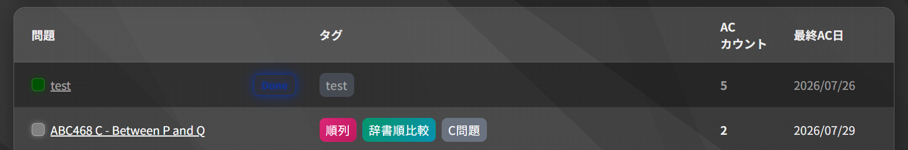
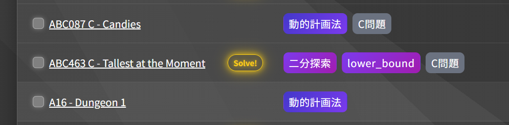
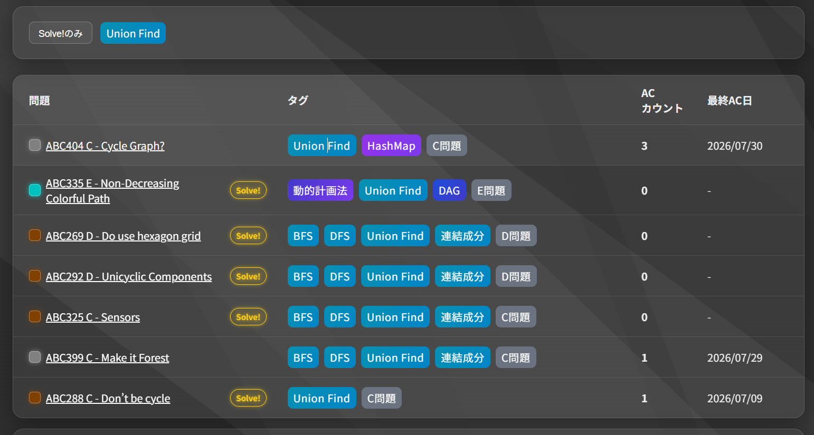

# CP Tracker

競技プログラミング精進記録用アプリケーション。

[バックエンドリポジトリ](https://github.com/kento-yoshidu/cp_tracker_backend)

## 機能

### ACカウントと最終AC日

問題ごとにACカウントを記録。最終AC日も記録。

### バッヂの表示

最終AC日から一定期間を経過するとSolve!バッヂが表示される。表示条件は以下の通り。

|AC数|最終日からの経過日数|
|---|---|
|0|0日（常に表示）|
|1|3日|
|2|7日|
|3|30日|
|4|60日|

5回ACすると完全に理解したとみなし、Doneバッジを表示する。継続してACはできる。

### タグ

問題に対してタグを設定。

タグで問題を絞り込み。

